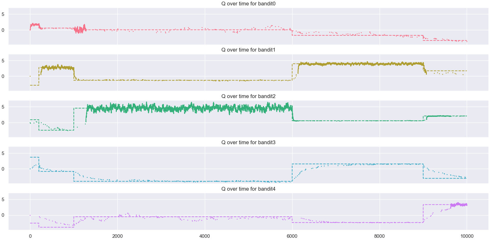

# Homework Task 1: Bandit 

*Multiarmed bandit* is a a type of reinforcement learning problem where
the the general idea of a problem is centered around with $k$ different options (actions) and its' objective 
is to *maximise* the reward given by taking those actions. Some 
would say that this is the *general schema* of all reinforcement learning problems

The problem is represented by having $k$ *bandits* (or one bandit
with $k$ different *options* to choose from) which are, for example
*slot machines* or *restaurants* in a new town, etc. An agent
must choose one *bandit* and in return will get a reward
for interracting with the latter. Therefore, it has to learn
the optimal *policy*, or what bandit is the best to 
interract with.

Here, we will be trying to solve the *slot machines* version, where
we're faced with multiple slot machines and try to maximize our reward.
Every machine (from now on, *bandit*) has two attributes:

- *mean* or the average reward it gives us when interracting with
- *span* that determines the range of rewards of the bandit

Our task is to determine the average mean return of all *bandits* and
try to always play the *optimal* one - the one that gives us
the maximum reward. One idea is to play many games and then average, but
that'll take much more computing power than needed, so another idea emerges with a huge advantage.
We'll use *filtering* or *estimator* of mean values, given by formula

$q(b) \leftarrow (1 - \alpha)q(b) + \alpha r$

where

- $b$ is the bandit we play
- $q$ is the *mean* value
- $\alpha$ is the learning factor

This allows us not only to forget how many iterations we've had (which saves memory and computing time), but to
truly filter *anomalies*. To see how anomalies can emerge, consider that every bandit has a chance to return
a truly great reward few times, but not often. Using just averaging, we'll have a high *mean* value because
of the anomalies and that's not great, because the bandit is not great overall. Using *weighted averaging*,
we suppress those huge anomalies (exacly what *low pass filter* does).

## Estimation of *mean values* using the formula above for every bandit

Namely, here's a five bandit problem with the *dynamic* environment, meaning that every *bandit*
changes its' true *mean* and *span* values with time.

