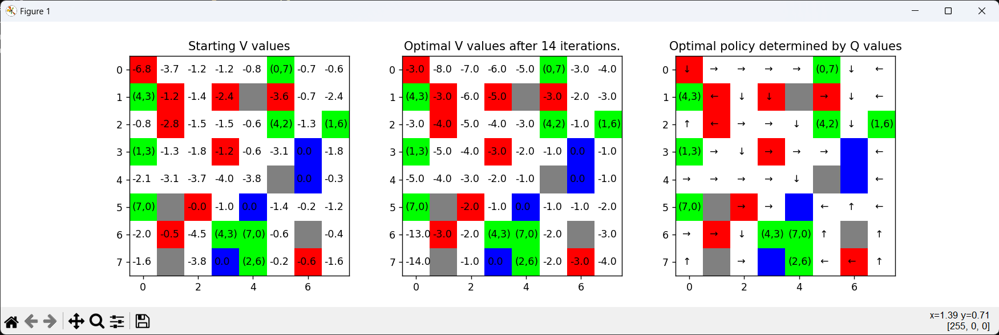
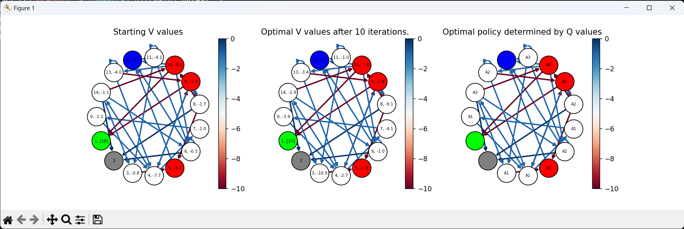
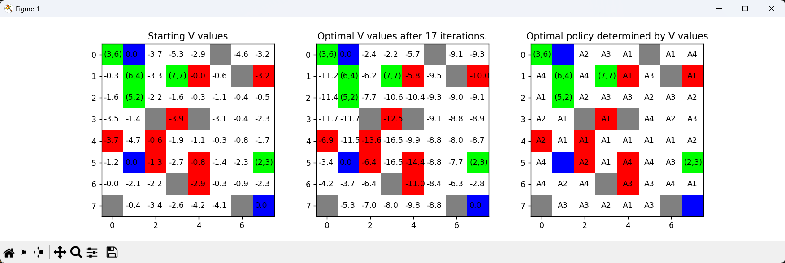
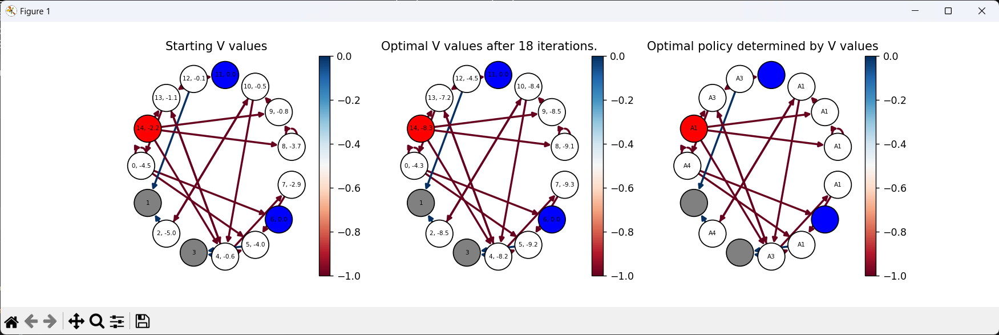

# Homework Task 2: Maze

A task consists of an agent whose task is to find an optimal path to a *terminal state* in maze. A maze can be constructed as:

- *board*, which looks like an average maze from a bird's eye
- *graph*, which is your usual directed graph

Also, the *environment* (basically, *Markov decision process*) can be either *deterministic* or *stochastic*. *Environment* class
is implemented as a *callable* object which acts as a *MDP*, given state and action. 

It should be mentioned that, when considering *stochastic MDP*, *actions* do not necessarly mean *directions of acting*. 
For example, *Action.A1* will not always mean the transition to the right of the standing cell - 
**there is no clear mapping between *actions* and *directions* in *stochastic case***. Of course, some probabilities collapse to 
$1$ (others to $0$) when we're talking about *deterministic MDP* - **then** we're having a clear map between *actions* and *directions*.

*Probabilities* are implemented as *dataclass*, which, given state and action, returns a probability of taking an action and following 
a certain direction. Here, we'll consider that the probabilities of taking any action in any state is always $1$, for every action 
(meaning, $\pi(a | s) = 1 \text{, } \forall a$). 

$Q$ values are implemented as *dataclass* as well - $V$ values aren't, being a *Q* subset.

There are two *dynamic programming* algorithms implemented - *Value iteration* and *Policy iteration*.

## Value iteration

We're considering finding the optimal policy using $Q$ values and $V$ values.

### Value iteration using Q values (*deterministic MDP*)

### Value iteration using V values (*stochastic MDP*)

