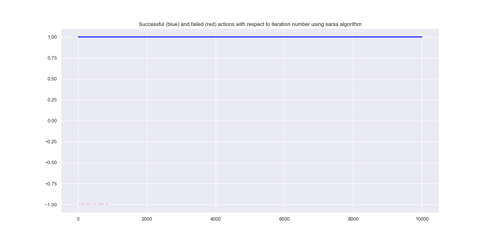
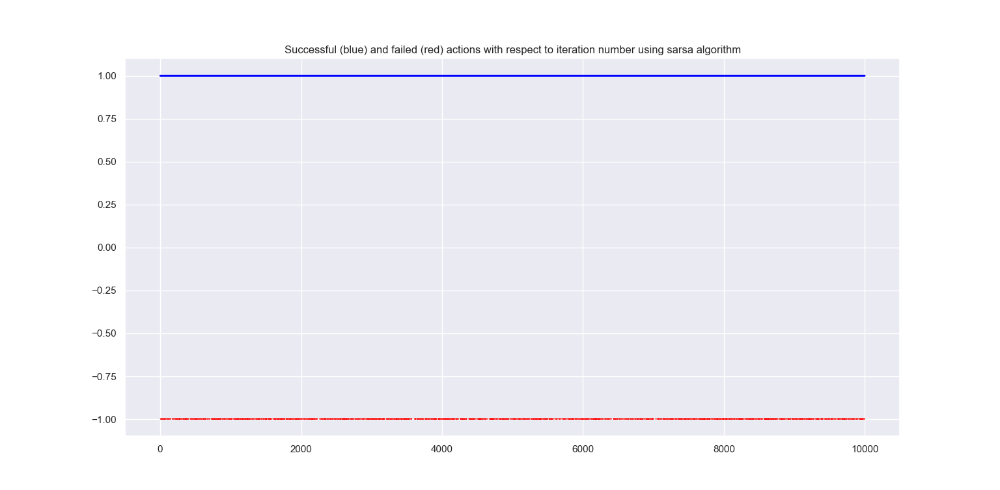

# Homework Task 4: Cartpole

A task consists of a pole on a cart (weirdly named *Cartpole*). It is our task to provide a optimal action for every state a cartpole is in. 

A state consists of four variables:

- $x$, which is cart's *position*
- $v$, which is cart's *velocity*
- $\theta$, which is pole's *angular position*
- $\dot{\theta}$, which is pole's *angular velocity*

The equations of motion are represented using state space representation:

 
  $x \equiv \dot{x_0} = x_1$
  
  $\dot{x} \equiv \dot{x_1} \equiv F = \frac{4f - m\sin{(x_2)}(3g\cos{(x_3)} - 4lx_3^{2})}{4(m + M) - 3m\cos^{2}{(x_2)}}$
  
  $\theta \equiv \dot{x_2} = x_3$

  $\dot{\theta} \equiv \dot{x_3} \equiv G = \frac{(m + M)g\sin{(x_2)} - \cos{(x_2)}(f + ml\sin{(x_2)}x_3^{2})}{l(\frac{4}{3}(m + M) - m\cos^{2}{(x_2)})}$ 

where 

- $m$ is the *mass of pole*
- $M$ is the *mass of cart*
- $l$ is the *half-length of pole* 

The whole system is discretized using *forward differentiation* (*Euler1*) method. The state space equations then become 

$x_0(k + 1) = x_0(k) + Tx_1(k)$

$x_1(k + 1) = x_1(k) + TF(k)$

$x_2(k + 1) = x_2(k) + Tx_3(k)$

$x_3(k + 1) = x_3(k) + TG(k)$

where $T$ is *sample time*. 

A control action $f$ (force actuated on a cart) and sample time $T$ are *inversely* correlated, meaning that the greater the *control span*
(larger the interval of possible force magnitudes), the smaller sample time is needed to register the next state and execute the next
control action. Of course, that interval should be somewhat *rich* in values.

Let's say that we have only three control values, or *actions* - $-1.0N$, $0N$, $1.0N$. If the cart (and the pole with it) has somewhat bigger mass, 
the system is *controllable* - yet if cart has some low mass, acting with $1.0N$ of force can lead to undesired behaviour and 
*non-controllable* system, if the sampling time is long. Shorter sampling time will assure us that we can control any system.

Here, the *SARSA* algorithm is implemented. *SARSA* algorithm updates the *state-action values* $Q$ by using the update formula 

$Q(s, a) \leftarrow (1 - \alpha)Q(s, a) + \alpha(r + \gamma Q(s^{+}, a^{+}))$

where:

- $s$ is the *current state*, and $s^{+}$ is the *next state*
- $a$ is the *current selected action* based on current policy, and $a^{+}$ is the *next selected action* based on current policy.
- $\alpha$ is the *filterring* or *learning* factor$
- $\gamma$ is the *discount factor*

The policy used while *behaving* is $\epsilon$*-greedy*, and the *target* policy is, of course, *fully greedy*.

## *SARSA* algorithm with appropriate small sampling time

## *SARSA* algorithm with long sample time

